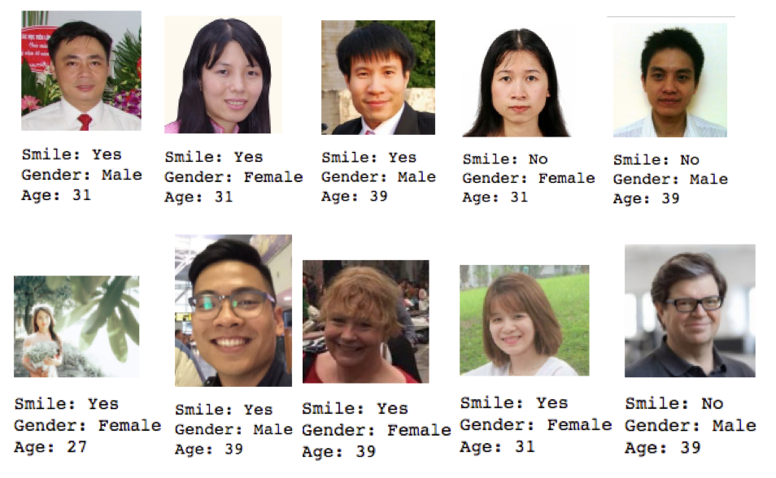
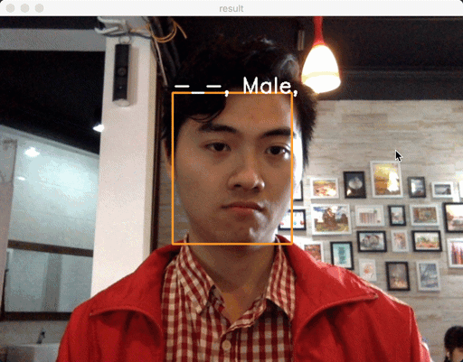

# Smile detection, gender and age estimation using Multi-task Learning

On the original paper [DEX: Deep EXpectation](https://www.vision.ee.ethz.ch/en/publications/papers/proceedings/eth_biwi_01229.pdf) the authors were able to display remarkable results in classifying the age of an individual based on a given image alone.

Let see how accuracy (bad I guess), with limited resources, we can get with self-construct architecture. And not only age, we also classifying gender and smile by using multi-task training technique.

## Dependencies
* Python 3.x
* OpenCV 2
* tensorflow
* numpy
* pandas
* matplotlib
* scipy
* seaborn
* [MTCNN](https://github.com/ipazc/mtcnn) for face detection

## Usage
### Download datasets
First download [GENKI4K](https://github.com/ipazc/mtcnn) and [IMDB-WIKI](https://data.vision.ee.ethz.ch/cvl/rrothe/imdb-wiki/) (cropped face version) dataset.

### Preprocess data
First run [imdb-preprocess.ipynb](./imdb-preprocess.ipynb). This step preprocess IMDB-WIKI dataset, filter out images with more than one face, gender is NaN and invalid age. All saved in a pickle file.

Next run [prepare-data.ipynb](./prepare-data.ipynb). This will split two datasets in to training parts and test parts. The IMDB-WIKI dataset we will split into two separate datasets, gender and age datasets. So we have 3 datasets: age gender age. Each file will run into MTCNN network to detect and crop face, resize to 48x48 and convert to gray, then all datasets are saved into pickle files.

### Training
Run [CNN2Head_train.ipynb](./CNN2Head_train.ipynb), using exponential decay to reduce learning rate over time. Change your datasets folder links, training parameters in [const.py](./const.py). Tensorboard's log will be saved in `summary` folder, training result in each batch is written in [log.csv](./log.csv).
```python
WEIGHT_INIT = 0.01
NUM_TASKS = 3
IMG_SIZE = 48
INIT_LR = 0.01
USE_BN = True
BN_DECAY = 0.99
EPSILON = 0.001
WEIGHT_DECAY = 0.01
DECAY_STEP = 1000
DECAY_LR_RATE = 0.95
BATCH_SIZE = 128

USE_GPU = True
SAVE_FOLDER = './save/current/'
NUM_EPOCHS = 2000
DROP_OUT_PROB = 0.5
```

### Evaluation
Run [evaluate.ipynb](./evaluate.ipynb) to evaluate learned model on test datasets.

### Testing
For single file, see [test.ipynb](./test.ipynb) file for more example.
 

For demo on webcam, run [demo.py](./demo.py) file.
<div>

</div>

### TODO
* Augmentation for balanced label, reduce overfitting
* Improve accuracy

### References and Acknowledgments
This code is part of my GR project at HUST University. Following papers and codes are referred:
1. Dinh Viet Sang, Le Tran Bao Cuong, and Do Phan Thuan. 2017., Facial Smile Detection Using Convolutional Neural Networks. In The 9th International Conference on Knowledge and Systems Engineering (KSE 2017). 138–143.
2. Dinh Viet Sang, Le Tran Bao Cuong, Pham Thai Ha, Multi-task learning for smile detection, emotion recognition and gender classification, December 2017
3. [IMDB-WIKI: trying a small model for age classification
](https://surfertas.github.io/deeplearning/2017/04/18/imdbwiki.html)
3. [MultiTask-MergeDataset - Le Tran Bao Cuong](https://gitlab.com/ltbclqd2805/MultiTask-MergeDataset)
